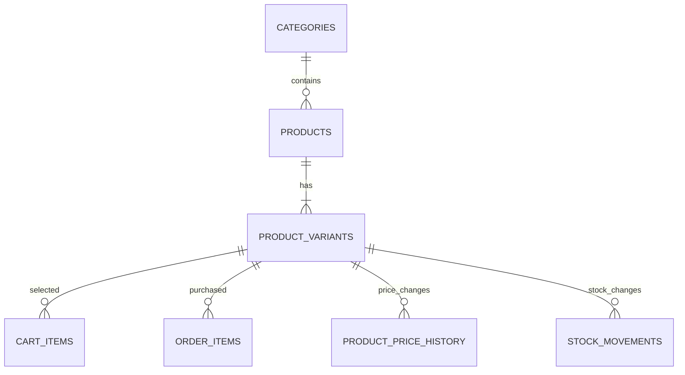

# FreshMart — Project Progress & Changelog

เอกสารนี้เป็นจุดอ้างอิงกลางสำหรับติดตามสถานะของโปรเจกต์ **ร้านชำเจ๊ดี / FreshMart**  
ใช้บันทึกสิ่งที่ทำเสร็จแล้ว บั๊กที่พบ การตัดสินใจสำคัญ งานค้าง และจุดเริ่มงานครั้งถัดไป

> อัปเดตล่าสุด: 8 สิงหาคม 2026
> สถานะภาพรวม: **กำลังพัฒนา — Phase 1–10 ปิดแล้ว; Phase 11 Repeat Purchase Insights พัฒนาและ Deploy Backend แล้ว รอ Merge/ทดสอบจริง**
> จุดอ้างอิง GitHub: `main@fe21625f74996860ddd382db2b009fc3ae1b9935`

---

## 0. จุดเริ่มงานครั้งถัดไป

อ่านส่วนนี้ก่อนเพื่อเริ่มพัฒนาต่อโดยไม่ต้องไล่เดาสถานะจากหลายระบบ

| จุดตรวจ | สถานะที่ยืนยันแล้ว |
|---|---|
| GitHub `main` | Merge commit ล่าสุด `fe21625f74996860ddd382db2b009fc3ae1b9935` จาก PR #17 (Phase 10) |
| Branch งานปัจจุบัน | `agent/phase-11-repeat-purchase-insights` — วิเคราะห์สินค้าซื้อบ่อยและวันที่เสนอขายซ้ำ |
| GitHub Pages | Phase 1–10 อยู่ใน `main`; หน้า Phase 11 รอ Merge |
| Supabase Backend | Migration `repeat_purchase_insights`, `repeat_purchase_insights_tuning` Deploy แล้ว; Project `ACTIVE_HEALTHY` |
| Database migrations | ไฟล์ Migration ล่าสุดอยู่ใน `supabase/migrations/` และต้อง Deploy แยกจาก GitHub Pages |
| Edge Functions | Source อยู่ใน `supabase/functions/`; ตรวจเวอร์ชันที่ Deploy ก่อนแก้ไขทุกครั้ง |
| งานแรกที่ควรทำ | ทดสอบ Phase 11: เปิด Customer Center ตรวจสินค้า Variant รอบซื้อ วันที่แนะนำ และตัวกรองถึงกำหนดเสนอขายซ้ำ |

### ข้อกำหนดที่ห้ามเปลี่ยนโดยไม่ทบทวน PRD

- ลูกค้าเข้าใช้งานผ่าน LINE LIFF เท่านั้น; Admin ใช้ Supabase Auth แบบ Email/Password
- สินค้าใช้โครงสร้าง Categories → Products → Product Variants และตะกร้าอ้างอิง `variant_id`
- เมื่อรับเองหน้าร้าน ให้ซ่อนตัวเลือกชำระเงินและใช้ `pay_at_store`
- เมื่อจัดส่ง ให้เลือกเงินสด โอนธนาคาร หรือ PromptPay ได้
- LIFF Profile ไม่ให้เบอร์โทรอัตโนมัติ ลูกค้าต้องกรอกหรือยืนยันเอง
- ระบบไม่สร้างหนี้จากสถานะชำระเงินโดยอัตโนมัติ; Admin ต้องบันทึกบัญชีค้างชำระอย่างชัดเจน
- ออเดอร์ต้องเก็บ Snapshot ที่อยู่และ GPS เพื่อไม่ให้ประวัติเดิมเปลี่ยนตามการแก้ที่อยู่ภายหลัง
- ห้ามใส่ Supabase `service_role`, LINE Channel Secret หรือ Access Token ลง Frontend และ Repository

---

## 1. ข้อมูลโปรเจกต์

| รายการ | ค่า |
|---|---|
| ชื่อร้าน | ร้านชำเจ๊ดี |
| ชื่อโปรเจกต์ | FreshMart |
| Repository | `aodxx/freshmart` |
| Production | <https://aodxx.github.io/freshmart/> |
| LINE LIFF | ตั้งค่าแล้ว — เปิดผ่าน Rich Menu/LIFF Link ของร้าน |
| LIFF ID | ตั้งค่าแล้ว — ดูค่าปัจจุบันใน LINE Developers และ `store_settings` |
| LINE Login Channel ID | ตั้งค่าแล้ว — ดูค่าปัจจุบันใน LINE Developers |
| Supabase Project | `freshmart` — ดู Project Reference ใน Supabase Dashboard |
| Supabase Region | Singapore (`ap-southeast-1`) |
| หน้าร้าน | บ้านลำพาย |
| Google Maps | <https://maps.google.com/maps?q=7.622478,99.999591> |
| เวลาเปิด–ปิด | 06:00–18:09 |
| ค่าจัดส่งเริ่มต้น | 100 บาท |
| ส่งฟรีเมื่อยอดถึง | 500 บาท |

### เทคโนโลยี

- Frontend: HTML5, CSS3, Vanilla JavaScript (ES6 Modules)
- UI: Bootstrap 5, SweetAlert2, Mobile-first
- Backend: Supabase PostgreSQL, Auth, Storage, Realtime, Edge Functions
- LINE: LINE LIFF, LINE Login, LINE Messaging API
- Hosting: GitHub Pages
- ค่าใช้จ่ายเป้าหมาย: Supabase Free Plan + GitHub Pages = `$0/เดือน`

---

## 2. สถานะโมดูล

คำอธิบายสถานะ:

- ✅ พร้อมใช้งาน/พัฒนาแล้ว
- 🧪 พัฒนาแล้ว รอทดสอบจริงครบทุกกรณี
- 🚧 พัฒนาบางส่วน
- ⏳ ยังไม่เริ่ม
- ⚠️ ต้องตรวจสอบหรือมีข้อจำกัด

| โมดูล | สถานะ | รายละเอียดล่าสุด | งานที่ยังเหลือ |
|---|---:|---|---|
| GitHub Pages | 🧪 | Phase 1–10 อยู่ใน `main`; Phase 11 รอ Merge | ตรวจ Repeat Purchase Insights หลัง Deploy |
| Supabase Health Check | 🧪 | GitHub Actions อ่านฐานข้อมูลทุก 2 วันและรันเองได้ | ตรวจ Workflow Run แรก; Scheduled Workflow อาจถูกปิดหาก Repository ไม่มี Activity 60 วัน |
| FreshMart Design System | 🧪 | Custom CSS, Tokens และ Components ใหม่; Bootstrap ใช้เฉพาะ Grid/Modal/Utilities | ทดสอบภาพจริงบน LINE iOS/Android และจอ Desktop |
| FreshMart Admin PWA | 🧪 | Phase 11 อัปเดต App Shell v11 และ Customer Center แสดงโอกาสเสนอขายซ้ำ | ทดสอบอัปเดต Service Worker บนอุปกรณ์จริง |
| LINE LIFF | 🧪 | บังคับลูกค้าเข้าใช้งานผ่าน LIFF และใช้ LIFF ID ที่แก้ไขแล้ว | ทดสอบ Android/iOS และกรณีเปิดนอก LINE |
| โปรไฟล์ LINE | 🧪 | ดึงชื่อและรูปโปรไฟล์ พร้อมบันทึกประวัติลูกค้า | เบอร์โทรไม่สามารถดึงจาก LIFF Profile โดยตรง ต้องให้ลูกค้ากรอก/ยืนยัน |
| Supabase Auth | ✅ | ใช้ Email/Password สำหรับผู้ดูแลระบบ | เปิด Leaked Password Protection เมื่อแผน/การตั้งค่ารองรับ |
| Profiles / Roles | ✅ | ใช้ `profiles.role` แยก `user` และ `admin` พร้อม RLS | เพิ่ม UI เปลี่ยน Role หากต้องการ |
| หมวดหมู่สินค้า | 🧪 | เพิ่มหมวดหมู่จากหน้า Admin ได้ ไม่ผูกหมวดไว้ในโค้ด | เพิ่มแก้ไข/เรียงลำดับ/ปิดหมวดหมู่ |
| สินค้า | 🧪 | เพิ่ม แก้ไข และปิดขายชั่วคราวได้ | ทดสอบฟอร์มกับข้อมูลจริงจำนวนมาก |
| Product Variants | 🧪 | สินค้า 1 รายการมีหลายขนาด ราคา สต็อก และบาร์โค้ดได้ | เพิ่ม UI จัดการ SKU หากต้องการ |
| Barcode Scanner | ✅ | ติดตั้ง PWA และทดสอบกล้อง/สแกนบาร์โค้ดจริงผ่านแล้ว; Phase 4 นำ Scanner เดิมมาใช้กับ POS | เฝ้าดูการใช้งานจริง |
| Open Product Dataset | 🧪 | อยู่ใน `main`; ค้น local-first แล้ว fallback ไป Open Food Facts; Edge Function ถูก Deploy แล้ว | ทดสอบนำเข้า Dataset ภาษาไทยแบบ CSV/TSV ขนาดเล็ก |
| รูปสินค้า | 🧪 | Bucket `product-images` แบบ Public; บีบอัด WebP; PR #5 แก้กรอบ 4:3 และใช้ `object-fit: contain` แล้ว | ทดสอบรูปจริงแนวตั้ง/แนวนอนบนมือถือหลายรุ่น |
| สต็อก | ✅ | Phase 3 ปิดแล้วหลังทดสอบรับเข้า ปรับลด ตรวจนับ และสแกนบาร์โค้ดจริง; POS ใช้ FEFO/Append-only Ledger เดิม | เฝ้าดูการใช้งานจริง |
| Storefront POS | ✅ | Phase 4 ปิดแล้วหลัง Merge PR #11 และทดสอบขายจริงด้วยเงินสด PromptPay ส่วนลด และสแกนบาร์โค้ด | เฝ้าดูการใช้งานจริง |
| ประวัติราคา | ✅ | บันทึกราคาเก่า ราคาใหม่ ผู้แก้ และเวลา; Phase 5 แสดง Price Audit บน Dashboard | เฝ้าดูการใช้งานจริง |
| รายการสินค้า | ✅ | Phase 6 ปิดแล้วหลัง Merge PR #13 และทดสอบ Product Detail, Variant/จำนวน และเพิ่มตะกร้าผ่าน LINE LIFF | เฝ้าดูการใช้งานจริง |
| ตะกร้า | 🧪 | เก็บใน `localStorage` โดยใช้ `variant_id`; รองรับจำนวนสินค้า | ทดสอบการ Sync DB สำหรับผู้ใช้ Supabase Auth |
| Checkout | 🧪 | ตรวจราคา/สต็อกในฐานข้อมูล พร้อมที่อยู่/GPS; Phase 8 แก้ Coupon Preview; Phase 9 เชื่อมหน้า Saved Addresses และเลือกค่าเริ่มต้นอัตโนมัติ | ทดสอบเลือกที่อยู่หลัก/ที่อยู่อื่น/ที่อยู่ใหม่ผ่าน LINE LIFF |
| การรับสินค้า | 🧪 | รองรับจัดส่งและรับเองหน้าร้าน | เพิ่มช่วงเวลานัดรับที่ปิด Slot เต็มได้ |
| เงินสด | 🧪 | แสดง Popup เตรียมเงินตามยอดเมื่อเลือกจัดส่ง | ทดสอบข้อความและยอดรวมค่าจัดส่ง |
| โอนธนาคาร | 🧪 | ข้อมูลบัญชีตั้งค่าใน `store_settings` พร้อมปุ่มคัดลอก | เพิ่ม QR/โลโก้ธนาคารหากต้องการ |
| PromptPay | 🧪 | POS สร้าง Thai QR ตามยอดจาก `store_settings`; Checkout ลูกค้ายังคงมีปุ่มคัดลอก | ทดสอบสแกน QR POS ด้วยแอปธนาคารจริง |
| รับเองหน้าร้าน | 🧪 | ซ่อนตัวเลือกชำระเงินและตั้งเป็น `pay_at_store` | ทดสอบช่วงเวลานัดรับ |
| สลิปชำระเงิน | 🧪 | Bucket `payment-slips` เป็น Private รองรับ JPG/PNG/WebP ไม่เกิน 5 MB | เพิ่มบีบอัดสลิปก่อนอัปโหลด |
| ประวัติคำสั่งซื้อ | 🧪 | ลูกค้าดูออเดอร์ ยอดค้างชำระ ยอดคงเหลือ และประวัติรับชำระของตนผ่าน LIFF API | ทดสอบกับรายการค้างชำระจริง |
| Admin Orders | ✅ | Phase 2 ปิดแล้ว: ตรวจสลิป สถานะ จัดส่ง Timeline คืนสต็อก และ LINE แจ้งลูกค้า | เฝ้าดูการใช้งานจริง |
| Dashboard | ✅ | Phase 5 ปิดแล้วหลัง Merge PR #12 และทดสอบยอดวันนี้ กราฟ ช่องทางขาย และสินค้าขายดีด้วยรายการ POS จริง | เฝ้าดูการใช้งานจริง |
| สมาชิก/ลูกค้า | 🧪 | Phase 9 เพิ่ม Saved Addresses; Phase 10 เพิ่มหมายเหตุ/ป้าย; Phase 11 เพิ่มสินค้า Variant ที่ซื้อบ่อย รอบซื้อ และวันที่เสนอขายซ้ำ | ทดสอบกับลูกค้าที่ซื้อ Variant เดิมสำเร็จอย่างน้อย 2 วัน |
| คูปอง | 🧪 | Phase 7 ปิดแล้ว; Phase 8 เพิ่ม Preview แบบ Server-authoritative โดยไม่เพิ่ม `used_count` และแสดงเงื่อนไขก่อนยืนยัน | ทดสอบยอดต่ำกว่า/เท่ากับ/สูงกว่า 200 บาท |
| รีวิว | ✅ | Phase 6 ปิดแล้วหลัง Merge PR #13 และทดสอบเพิ่ม แก้ไข ลบ พร้อมคะแนนเฉลี่ยจากออเดอร์ `completed` ผ่าน LINE LIFF | เฝ้าดูการใช้งานจริง |
| LINE แจ้งเตือน Admin | 🧪 | Edge Function รองรับส่งส่วนตัวและกลุ่มผ่าน Messaging API | ทดสอบ Token/User ID/Group ID จริงทุกปลายทาง |
| LINE แจ้งกลับลูกค้า | 🚧 | มีฐานข้อมูล LINE User ID | เพิ่ม Push Message เมื่อตรวจเงิน/จัดส่ง/เสร็จสิ้น |
| Realtime Orders | ✅ | Phase 8 ปิดแล้วหลัง Merge PR #15 และทดสอบ Database Broadcast, Customer topic แบบ token สุ่ม, Admin Private Channel และ Polling สำรอง | เฝ้าดูการใช้งานจริง |

---

## 3. โครงสร้างข้อมูลปัจจุบัน

### ตารางหลัก

| ตาราง | หน้าที่ |
|---|---|
| `profiles` | โปรไฟล์ผู้ใช้ Supabase และ Role |
| `customers` | ลูกค้าที่เข้าผ่าน LINE LIFF |
| `customer_addresses` | ที่อยู่จัดส่งของลูกค้า |
| `customer_receivables` | ยอดค้างชำระแยกตามลูกค้าและออเดอร์ |
| `receivable_payments` | ประวัติรับชำระบางส่วน/ทั้งหมดของยอดค้าง |
| `categories` | หมวดหมู่สินค้า |
| `products` | ข้อมูลสินค้าหลัก ไม่มีราคาใช้งานจริงในชั้นนี้ |
| `product_variants` | ขนาด ราคา สต็อก SKU และสถานะ |
| `open_product_catalog` | ข้อมูลอ้างอิงจาก Open Dataset: บาร์โค้ด ชื่อ แบรนด์ รูป หมวด และแหล่งที่มา |
| `product_price_history` | ประวัติการเปลี่ยนราคา |
| `stock_movements` | Ledger แบบ Append-only ของการรับเข้า ขาย คืน ตัดออก และตรวจนับ |
| `inventory_lots` | ยอดคงเหลือแยกเลขล็อตและวันหมดอายุ |
| `stock_counts` / `stock_count_items` | หัวรายการตรวจนับ จำนวนตามระบบ จำนวนจริง และส่วนต่าง |
| `carts` / `cart_items` | ตะกร้าที่ Sync กับบัญชี Supabase |
| `orders` / `order_items` | คำสั่งซื้อและ Snapshot สินค้า/ขนาด/ราคา |
| `payments` | วิธีชำระ สถานะ และ Path สลิป |
| `coupons` | คูปองและเงื่อนไขส่วนลด |
| `coupon_audit_log` | ประวัติการสร้าง แก้ไข และเปิด–ปิดคูปองแบบ Append-only |
| `reviews` | รีวิวสินค้า |
| `store_settings` | ข้อมูลร้าน บัญชี PromptPay LIFF และค่าจัดส่ง |

### ความสัมพันธ์สินค้า



### หลักการสำคัญ

- ตะกร้าและการสั่งซื้ออ้างอิง `variant_id`
- ราคาและสต็อกถูกตรวจจากฐานข้อมูลขณะ Checkout
- `order_items` เก็บ Snapshot ชื่อสินค้า ชื่อขนาด และราคาขณะซื้อ
- `orders` เก็บ Snapshot ที่อยู่และพิกัด GPS เพื่อให้ออเดอร์เก่ายังคงนำทางได้ แม้ลูกค้าแก้ที่อยู่ภายหลัง
- ยอดค้างชำระสร้างโดย Admin เท่านั้น และคำนวณยอดคงเหลือจากประวัติ `receivable_payments`
- สินค้าที่เคยมีออเดอร์ให้ปิด `is_active` แทนการลบ
- รูปสินค้าเก็บเพียง Storage Path เช่น `products/{product_id}/main.webp`

---

## 4. Storage และความปลอดภัย

| Bucket | Public | จำกัดไฟล์ | การใช้งาน |
|---|---:|---:|---|
| `product-images` | ใช่ | 1 MB | รูปสินค้า เปิดผ่าน Public URL |
| `payment-slips` | ไม่ | 5 MB | สลิป เปิดด้วยสิทธิ์เจ้าของ/Admin |

มาตรการที่ใช้แล้ว:

- เปิด RLS สำหรับตารางใน `public`
- ลูกค้าเห็นเฉพาะออเดอร์และการชำระเงินของตน
- เฉพาะ Admin เพิ่ม/แก้ไข/ปิดสินค้าและ Variant
- ไม่เก็บ `service_role` หรือ LINE Secret ใน Frontend/Repository
- Edge Function ใช้ Secrets ฝั่ง Supabase
- View `product_catalog` ใช้ `security_invoker`
- ฟังก์ชันสั่งซื้อคำนวณราคา ส่วนลด ค่าจัดส่ง และสต็อกใน Transaction
- จำกัด MIME type และขนาดไฟล์ Storage
- Public product bucket ไม่อนุญาตให้ผู้ใช้ทั่วไปไล่ดูรายชื่อไฟล์

ข้อควรระวัง:

- Supabase Security Advisor ยังแจ้งว่า **Leaked Password Protection Disabled**
- ลูกค้าใช้ LIFF เป็นหลัก แต่บัญชี Admin แบบ Email/Password ควรใช้รหัสผ่านยาวและไม่ซ้ำ
- ห้าม Commit ค่า `service_role`, LINE Channel Secret หรือ Access Token

---

## 5. การตั้งค่าร้านและการชำระเงิน

### จัดส่งโดยร้าน

ลูกค้าเลือกได้:

1. โอนบัญชีธนาคาร
2. PromptPay
3. เงินสดเมื่อรับสินค้า

ค่าจัดส่งปัจจุบัน 100 บาท และส่งฟรีเมื่อยอดสินค้าถึง 500 บาท

### รับเองหน้าร้าน

- ไม่แสดงตัวเลือกชำระเงิน
- ระบบใช้ `pay_at_store`
- ที่อยู่ร้าน: บ้านลำพาย
- เปิด 06:00–18:09

### บัญชีรับเงิน

- ข้อมูลบัญชีธนาคารและ PromptPay ตั้งค่าในตาราง `store_settings`
- เอกสารใน Public Repository ไม่บันทึกหมายเลขบัญชี หมายเลข PromptPay หรือ Secrets
- หากเปลี่ยนข้อมูลรับเงิน ให้แก้ใน Supabase และทดสอบปุ่มคัดลอกบน Checkout

---

## 6. ประวัติการเปลี่ยนแปลง

### 8 สิงหาคม 2026 — Phase 11 Repeat Purchase Insights

- ยืนยันปิด Phase 10 หลัง Merge PR #17
- เพิ่ม RPC แบบ Admin-only วิเคราะห์สินค้าและ Variant จากออเดอร์ `paid`, `preparing`, `shipped`, `completed`
- รวมหลายออเดอร์ในวันเดียวเป็นหนึ่งวันซื้อ ตาม Timezone `Asia/Bangkok`
- แสดงจำนวนวันซื้อ จำนวนชิ้น วันที่ซื้อล่าสุด ช่วงห่างเฉลี่ย และวันที่แนะนำให้เสนอขายซ้ำ
- เพิ่ม KPI และตัวกรองลูกค้าที่ถึงกำหนดเสนอขายซ้ำ พร้อมสถานะถึงกำหนด/ใกล้ถึงกำหนด/รอข้อมูล
- เพิ่ม Partial Index สำหรับออเดอร์ลูกค้าที่ใช้วิเคราะห์ และจำกัดผลสูงสุด 5 สินค้าต่อลูกค้าในหน้าเว็บ
- RPC ใช้ `SECURITY INVOKER`, ตรวจ Admin, ไม่เปิดให้ `anon`/`service_role` และไม่ส่งข้อมูลไป LINE LIFF
- อัปเดต Admin PWA App Shell เป็น v11
- Deploy Migration `repeat_purchase_insights` และ `repeat_purchase_insights_tuning` บน Supabase Production
- PostgreSQL Dry Run, Production Smoke Test, Admin/Non-admin/Anonymous ACL Check และ Automated Tests ผ่าน 78/78

### 4 สิงหาคม 2026 — Phase 10 Customer Notes & Labels

- ยืนยันปิด Phase 9 หลัง Merge PR #16
- เพิ่มหมายเหตุภายในและป้ายกำกับสูงสุด 10 ป้ายต่อลูกค้าใน Customer Center
- เพิ่มการค้นหาจากหมายเหตุและป้าย พร้อมตัวกรองป้ายกำกับแบบอัตโนมัติ
- แสดงป้ายบนการ์ดลูกค้าและหน้า Detail; ข้อมูลทั้งหมดเป็น Admin-only
- เพิ่ม Audit History แบบ Append-only พร้อมผู้แก้และเวลา
- ลดสิทธิ์ตาราง `customers` โดยถอน Table Grant จาก `anon` และให้ Admin แก้ได้เฉพาะ `status`
- อัปเดต Admin PWA App Shell เป็น v10 และเพิ่ม Shortcut Customer Center
- Deploy Migration `customer_notes_labels` และ `customer_notes_labels_tuning` บน Supabase Production
- PostgreSQL Dry Run, Production Smoke Test, Admin/Non-admin/ACL/Audit Check และ Automated Tests ผ่าน 73/73; ข้อมูลทดสอบถูก Rollback

### 4 สิงหาคม 2026 — Phase 9 Customer Saved Address Management

- ยืนยันปิด Phase 8 หลัง Merge PR #15 และทดสอบ Coupon Preview กับ Realtime Orders สำเร็จ
- เพิ่มหน้า `addresses.html` แบบ Mobile-first ให้ลูกค้าเพิ่ม แก้ไข ลบ และตั้งที่อยู่หลัก
- รองรับ GPS และลิงก์นำทาง พร้อมเชื่อมหน้า Checkout และประวัติคำสั่งซื้อ
- เพิ่ม Transactional RPC สำหรับ Upsert, Set Default และ Delete โดยล็อกตามลูกค้าและจำกัดสูงสุด 20 ที่อยู่
- เมื่อลบที่อยู่หลัก ระบบเลื่อนรายการที่เหลือขึ้นมาแทน; ออเดอร์เก่ายังคง Snapshot เดิม
- ถอนสิทธิ์ตารางที่กว้างเกินจำเป็น และให้คำสั่งเขียนทำงานผ่าน `service_role` หลัง Edge Function ตรวจ LINE เท่านั้น
- Deploy Migration `customer_address_management`, `customer_address_management_tuning` และ `liff-api` v8 บน Supabase Production
- แก้กรณีสลับที่อยู่หลักชน Partial Unique Index ด้วยการล้างค่าเดิมก่อนตั้งค่าใหม่ใน Transaction เดียว
- PostgreSQL Dry Run, Production Smoke Test, ACL/RPC Check และ Automated Tests ผ่าน; ข้อมูลทดสอบถูก Rollback

### 4 สิงหาคม 2026 — Phase 8 Realtime Orders & Coupon Preview

- ยืนยันปิด Phase 7 หลัง Merge PR #14 และทดสอบ Admin Coupons สำเร็จ
- แปล `MIN_ORDER_NOT_MET` เป็นข้อความไทย พร้อมขั้นต่ำและยอดที่ต้องซื้อเพิ่ม
- เพิ่ม Coupon Preview จากฐานข้อมูลก่อนยืนยันออเดอร์ โดยไม่เพิ่ม `used_count`
- เพิ่ม Database Broadcast สำหรับลูกค้าผ่าน Topic Token แบบสุ่ม และ Admin ผ่าน Private Channel ที่ตรวจ RLS
- Payload Realtime ไม่ส่งชื่อ เบอร์โทร ที่อยู่ ยอดเงิน หรือรหัสลูกค้า และมี Polling สำรองทุก 45 วินาที
- Deploy Migration `realtime_orders_coupon_preview` และ `liff-api` v7 บน Supabase Production
- WebSocket Smoke Test, Admin/Non-admin RLS Test และ Automated Tests ผ่าน

### 4 สิงหาคม 2026 — Phase 7 Admin Coupon Management

- ยืนยันปิด Phase 6 หลัง Merge PR #13 และทดสอบ Product Detail, Variant/จำนวน, ตะกร้า และรีวิวผู้ซื้อจริงผ่าน LINE LIFF สำเร็จ
- เพิ่มหน้า `admin/coupons.html` แบบ Mobile-first พร้อม KPI ค้นหา และตัวกรองสถานะ
- รองรับสร้าง แก้ไข เปิด–ปิดคูปอง รวมส่วนลด ขั้นต่ำ เพดาน จำนวนสิทธิ์ และช่วงเวลา
- เพิ่ม `created_by`, `updated_by`, `updated_at` และ `coupon_audit_log` แบบ Append-only
- จำกัด Data API ให้ `anon` ไม่มีสิทธิ์ และให้เฉพาะ Admin ที่เข้าสู่ระบบอ่าน/เขียนคอลัมน์ที่อนุญาต
- ป้องกัน Frontend แก้ `used_count`, ผู้สร้าง/ผู้แก้ และ Audit History โดยตรง
- เพิ่ม Constraint สำหรับรูปแบบรหัส ความสัมพันธ์ส่วนลด และจำนวนสิทธิ์ไม่ต่ำกว่าที่ใช้ไปแล้ว
- Deploy Migration `admin_coupon_management` และ `admin_coupon_management_tuning` บน Supabase Production
- PostgreSQL Dry Run, Admin/Non-admin/ACL/Audit Smoke Test และ Automated Tests ผ่าน; ข้อมูลทดสอบถูก Rollback

### 4 สิงหาคม 2026 — Phase 6 Product Detail & Verified Reviews

- ยืนยันปิด Phase 5 หลัง Merge PR #12 และทดสอบขาย POS พร้อมตรวจยอดวันนี้ กราฟ ช่องทางขาย และสินค้าขายดีสำเร็จ
- เปลี่ยน `product-detail.html` จากหน้า Redirect เป็นหน้ารายละเอียดสินค้าแบบ Mobile-first
- เพิ่มภาพ ชื่อ แบรนด์ หมวด รายละเอียด ราคา สต็อก Variant ตัวเลือกจำนวน และเพิ่มลงตะกร้าหลายชิ้น
- เชื่อมการ์ดสินค้าและคะแนนบนหน้าร้านเข้าสู่ Product Detail โดยตรง
- เพิ่มสรุปคะแนน แถบกระจายดาว และรายการรีวิวที่ไม่เปิดเผย `user_id` หรือ `customer_id`
- รองรับลูกค้า LINE LIFF เพิ่ม แก้ไข และลบรีวิวของตน โดยต้องมีออเดอร์สินค้านั้นสถานะ `completed`
- เพิ่ม RPC ภายในสำหรับ Review Context/Upsert/Delete ซึ่งให้สิทธิ์เฉพาะ `service_role`; `anon` และ `authenticated` เรียกตรงไม่ได้
- Deploy Migration `customer_product_reviews`, `customer_product_reviews_tuning` และ `liff-api` v6 บน Supabase Production
- PostgreSQL Dry Run, Transaction Smoke Test, RLS/ACL/Privacy Check และ Automated Tests ผ่าน; ข้อมูลทดสอบถูก Rollback

### 4 สิงหาคม 2026 — Phase 5 Sales Analytics Dashboard

- ยืนยันปิด Phase 4 หลัง Merge PR #11 และทดสอบขายจริงด้วยเงินสด PromptPay ส่วนลด และสแกนบาร์โค้ดสำเร็จ
- เพิ่มหน้า `admin/dashboard.html` แบบ Mobile-first และเพิ่ม Dashboard ในเมนูหลัก/PWA Shortcut
- เพิ่ม KPI ยอดขายวันนี้ เดือนนี้ ปีนี้ จำนวนรายการ ค่าเฉลี่ยต่อรายการ และส่วนลด
- เพิ่มกราฟรายวันช่วง 7/30/90/365 วัน พร้อมแยก Online และ POS
- เพิ่มรายงานวิธีชำระ สถานะออเดอร์ สินค้าขายดี สินค้าใกล้หมด ประวัติราคา และรายการรับเงินล่าสุด
- เพิ่ม RPC `admin_sales_dashboard` ที่นับเฉพาะ Payment สถานะ `confirmed`, ไม่รวมออเดอร์ยกเลิก และใช้เขตเวลา `Asia/Bangkok`
- ใช้ `SECURITY INVOKER` + RLS + การตรวจ Admin และถอนสิทธิ์ `anon`
- Deploy Migration `sales_analytics_dashboard` บน Supabase Production
- PostgreSQL Dry Run, Admin/Non-admin Smoke Test และ Automated Tests ผ่าน; ไม่มีข้อมูลทดสอบถูกสร้าง

### 4 สิงหาคม 2026 — Phase 4 Storefront POS

- ยืนยันปิด Phase 3 หลัง Merge PR #10 และทดสอบรับเข้า ปรับลด ตรวจนับ และสแกนบาร์โค้ดจริงสำเร็จ
- เพิ่มหน้า `admin/pos.html` แบบ Mobile-first สำหรับค้นชื่อ/SKU/บาร์โค้ดและจัดรายการขาย
- เพิ่มกล้องหลัง การสแกนจากรูป และการกรอกรหัสเป็นทางสำรอง
- เพิ่มส่วนลดแบบเปอร์เซ็นต์/จำนวนเงิน พร้อมเหตุผลและผู้อนุมัติจากบัญชี Admin
- รองรับเงินสดพร้อมตรวจยอดรับ/เงินทอน และ PromptPay QR ตามยอด
- เพิ่มใบรับเงินสำหรับพิมพ์และรายการขายล่าสุด
- เพิ่ม RPC `admin_complete_pos_sale` ที่ล็อก Variant, สร้าง Order/Payment, ตัด FEFO และบันทึก Ledger ใน Transaction เดียว
- เพิ่ม Idempotency Key ป้องกันการส่งซ้ำแล้วตัดสต็อกหรือสร้าง Payment ซ้ำ
- Deploy Migration `storefront_pos` บน Supabase Production
- Transaction Smoke Test การขาย/ส่วนลด/เงินทอน/Ledger/Timeline/Idempotency/Rollback ผ่าน และ Automated Tests ผ่าน 33/33

### 3 สิงหาคม 2026 — Phase 3 Inventory Management

- เพิ่มหน้า `admin/inventory.html` แบบ Mobile-first พร้อม KPI ค้นหา กรอง และรายงาน 30 วัน
- รองรับรับเข้า ปรับเพิ่ม/ลด ลูกค้าคืน เสียหาย หมดอายุ สูญหาย และคืนผู้จำหน่าย
- เพิ่มเลขล็อต วันหมดอายุ ยอดคงเหลือระดับล็อต และการตัดล็อตแบบ FEFO
- เพิ่มการตรวจนับจริง บันทึกจำนวนตามระบบ จำนวนที่นับได้ และส่วนต่าง
- เปลี่ยน `stock_movements` เป็น Append-only Ledger และบล็อกการแก้จำนวนตรงจากหน้าสินค้า
- เพิ่ม Admin RPC ที่ล็อก Variant และบันทึกยอด/ล็อต/Ledger ใน Transaction เดียว
- เพิ่มสแกนกล้อง รูปภาพ และกรอกเลขบาร์โค้ดเพื่อเปิดแบบฟอร์มรับสินค้าเข้า
- Deploy Migration `inventory_management` และ `inventory_management_tuning` บน Supabase Production
- Transaction Smoke Test รับเข้า/เสียหาย/ตรวจนับ/Append-only/Rollback ผ่าน และ Automated Tests ผ่าน 26/26

### 3 สิงหาคม 2026 — Phase 2 Order Operations

- ยืนยันปิด Phase 1 หลังติดตั้ง FreshMart Admin PWA และทดสอบกล้อง/สแกนบาร์โค้ดจริงสำเร็จ
- ปรับหน้าคำสั่งซื้อ Admin เป็นศูนย์ปฏิบัติการแบบ Mobile-first พร้อม KPI ค้นหา และตัวกรอง
- เพิ่มรายละเอียดออเดอร์ รายการสินค้า ปุ่มโทร แผนที่ ตรวจสลิป ข้อมูลจัดส่ง และ Timeline
- เพิ่ม Transactional RPC สำหรับเปลี่ยนสถานะ ตรวจสลิป และบันทึกผู้จัดส่ง/เลขติดตาม
- บังคับลำดับสถานะ ป้องกันการยืนยันสลิปซ้ำ และบังคับเหตุผลเมื่อปฏิเสธหรือยกเลิก
- คืนสต็อก Variant และสิทธิ์ใช้คูปองอัตโนมัติเมื่อยกเลิกออเดอร์
- เพิ่ม `order_events` แบบ Append-only พร้อม RLS และดัชนีสำหรับงานหลังร้าน
- ลูกค้าเห็นเหตุผลสลิปไม่ผ่าน ส่งสลิปใหม่ ดูข้อมูลจัดส่ง และ Timeline ได้จาก LIFF
- ขยาย LINE Messaging ให้แจ้งลูกค้าเมื่อสถานะ/สลิป/ข้อมูลจัดส่งเปลี่ยน
- เพิ่ม Automated Tests สำหรับ Order Operations, Transaction, RLS, Timeline และ LINE

### 3 สิงหาคม 2026 — Phase 1 FreshMart Admin PWA Foundation

- เพิ่ม Web App Manifest, ไอคอน 192/512 และ Maskable Icon
- เพิ่ม Service Worker ขอบเขตเฉพาะ `admin/` และ Cache เฉพาะ App Shell ฝั่งหน้าเว็บ
- เพิ่มปุ่มติดตั้งแอป คำแนะนำสำหรับ iPhone/iPad และระบบแจ้งอัปเดตเวอร์ชัน
- เพิ่มหน้า Offline ที่อธิบายว่าธุรกรรมและสต็อกยังต้องใช้อินเทอร์เน็ต
- เปลี่ยนปุ่มสแกนเป็นแตะครั้งเดียวแล้วเปิดกล้องหลังทันที
- เพิ่มการตรวจสิทธิ์กล้องและข้อความแยกกรณีถูกปฏิเสธ ไม่พบกล้อง กล้องถูกใช้งาน และ LINE WebView
- เพิ่มการถ่ายรูป/เลือกรูปบาร์โค้ดและกรอกเลขเองเป็นทางสำรอง
- เพิ่ม Automated Tests สำหรับ GTIN, Camera Errors, Manifest, App Shell, Icons และ Scanner Fallbacks
- ไม่มีการเปลี่ยน Database Migration, RLS, Edge Function หรือข้อมูล Supabase Production ใน Phase นี้

### 30 กรกฎาคม 2026 — Production Checkpoint หลัง Merge PR #3–#6

- PR #3: Barcode Scanner และ Open Product Catalog เข้า `main`
- PR #4: แก้ fallback เมื่อบาร์โค้ดไม่พบ และแก้ Modal เพิ่มสินค้าบนมือถือให้เลื่อนได้
- PR #5: แก้สัดส่วนภาพสินค้าให้เห็นเต็มชิ้น; Merge commit `7f4171e5cb7fee805940d568596c37c8bb2ed274`
- PR #6: เพิ่ม Customer Center, GPS และบัญชีค้างชำระ; Merge commit `85912fe5ae0127088e1ef97b4431f0e212deddd4`
- ตรวจ GitHub แล้วไม่มี Pull Request ฟีเจอร์เปิดค้างก่อนสร้าง PR สำหรับเอกสารฉบับนี้
- Backend สำหรับ Barcode, GPS และบัญชีค้างชำระถูก Deploy แล้วตามงานใน PR ที่เกี่ยวข้อง; ต้องตรวจ Dashboard ซ้ำก่อนพัฒนารอบใหม่

### 30 กรกฎาคม 2026 — Customer GPS & Outstanding Balance

- เพิ่มการเลือกที่อยู่ที่บันทึก ที่อยู่จากคำสั่งซื้อล่าสุด หรือกรอกที่อยู่ใหม่
- เพิ่มปุ่มอ่านพิกัด GPS จากโทรศัพท์ และลิงก์ Google Maps สำหรับร้านนำทาง
- เก็บ Snapshot ที่อยู่ พิกัด และแหล่งที่มาของตำแหน่งไว้ในออเดอร์
- เพิ่ม `customer_receivables` สำหรับยอดค้างชำระรายออเดอร์
- เพิ่ม `receivable_payments` สำหรับรับชำระบางส่วนและเก็บประวัติ
- เพิ่ม Trigger ตรวจยอดไม่ให้รับชำระเกินยอดคงเหลือ
- เพิ่ม RLS และ Column-level Grants ให้เฉพาะ Admin อ่าน/บันทึก โดยไม่มีสิทธิ์ลบประวัติ
- เพิ่ม Customer Center พร้อม KPI ค้นหา กรอง ประวัติซื้อ ที่อยู่ และบัญชีค้างชำระ
- เพิ่มยอดค้างชำระในหน้าประวัติลูกค้า LIFF
- Deploy Edge Function `liff-api` เวอร์ชัน 3

### 27 กรกฎาคม 2026 — FreshMart UI Design System

- สร้าง Brand Tokens สำหรับสี ตัวอักษร รูปทรง เงา และ Motion
- เปลี่ยนฟอนต์หลักเป็น IBM Plex Sans Thai และ Manrope สำหรับ Display
- ลดบทบาท Bootstrap เหลือ Grid, Modal และ Utility Classes
- เพิ่ม App Header, Profile Pill และ Bottom Navigation สำหรับ LINE LIFF
- ออกแบบ Hero, Search Dock, Product Tile และ Variant Selector ใหม่
- ปรับตะกร้าเป็น Mobile Cart พร้อม Sticky Checkout Action
- ปรับ Checkout เป็น Step Form, Choice Card และ Payment Drawer
- ปรับ Order History เป็น Order Card พร้อม Status Pill
- ปรับ Login/Register ให้เป็นหน้าเฉพาะผู้ดูแลร้าน
- ปรับ Admin Navigation, Toolbar, Tables, Product Cards และ Modal
- รองรับ Mobile-first, Safe-area และ Reduced Motion
- คง Supabase, LIFF และ Business Logic เดิมไว้

### 27 กรกฎาคม 2026 — Supabase Free Plan Health Check

- เพิ่ม GitHub Actions Workflow `supabase-health-check.yml`
- เรียก Supabase REST API ทุก 2 วันเวลา 08:17 น. ตามเวลาไทย
- อ่านเพียง `store_settings.id` จึงไม่สร้างข้อมูลขยะ
- ใช้ Publishable Key ที่มีอยู่ใน Frontend และไม่ใช้ `service_role`
- เพิ่ม Retry, Timeout, HTTP status validation และตรวจรูปแบบ Response
- รองรับ `workflow_dispatch` สำหรับรันทดสอบด้วยตนเอง
- หมายเหตุ: GitHub อาจปิด Scheduled Workflow ของ Public Repository ที่ไม่มี Activity 60 วัน

### 27 กรกฎาคม 2026 — Product Variants & Inventory

- เพิ่มโครงสร้าง Categories → Products → Product Variants
- ย้ายสินค้าเดิม 5 รายการเป็น Variant “มาตรฐาน”
- ย้าย Cart Items และ Order Items เดิมให้มี `variant_id`
- เพิ่ม Snapshot `variant_name` ใน Order Items
- เพิ่ม `product_price_history`
- เพิ่ม `stock_movements`
- เพิ่ม Low-stock threshold
- ปรับ `product_catalog` ให้คืน Variants เป็น JSON
- ปรับรายการสินค้าให้เลือกขนาดก่อนเพิ่มตะกร้า
- ปรับ Local Cart เป็น `freshmart-cart-v2`
- ปรับ Checkout ให้ส่ง `variant_id`
- เพิ่มหน้า Admin จัดการสินค้าแบบหลายขนาด
- เพิ่มการย่อรูปและแปลง WebP ฝั่ง Browser
- สร้าง bucket `product-images`
- รัน Supabase Security/Performance Advisors
- แก้ Public bucket listing policy
- Merge PR [#1](https://github.com/aodxx/freshmart/pull/1)
- Production commit: `2fdc4c031df16adf7efd497f6c6646f63154b7bf`

### 27 กรกฎาคม 2026 — LINE LIFF Correction

- แก้ LIFF ID จากค่าที่ไม่ครบเป็นค่าปัจจุบันใน LINE Developers
- แก้ปัญหา `Invalid LIFF`
- เพิ่ม LIFF Endpoint: <https://aodxx.github.io/freshmart/>

### 27 กรกฎาคม 2026 — LIFF Customer & Fulfillment

- กำหนดให้ลูกค้าใช้งานผ่าน LINE LIFF
- เพิ่ม `customers`, `customer_addresses`, `store_settings`
- รองรับจัดส่งและรับเองหน้าร้าน
- จัดส่งรองรับ Bank Transfer, PromptPay และ Cash
- รับเองตั้งเป็น `pay_at_store` และซ่อนตัวเลือกชำระ
- เพิ่ม Popup เตรียมเงินสด
- เพิ่มปุ่มคัดลอกเลขบัญชีและ PromptPay
- เพิ่มข้อมูลร้าน แผนที่ เวลาเปิดปิด ค่าจัดส่ง และยอดส่งฟรี

### 26 กรกฎาคม 2026 — Foundation Release

- สร้าง Repository `aodxx/freshmart` แบบ Public
- สร้าง Supabase Project `freshmart`
- สร้าง Schema, RLS และ Seed Data เริ่มต้น
- สร้าง Authentication, Products, Cart, Checkout และ Orders
- สร้าง Private bucket สำหรับสลิป
- สร้าง Edge Functions สำหรับ LINE Messaging API
- เพิ่ม GitHub Pages Deployment

---

## 7. บั๊กและเหตุการณ์ที่เคยพบ

| วันที่ | ปัญหา | สาเหตุ | สถานะ/วิธีแก้ |
|---|---|---|---|
| 30 ก.ค. 2026 | สินค้าบางบาร์โค้ดค้นไม่พบแล้วไม่เปิดฟอร์มกรอกเอง | Backend ส่งข้อผิดพลาดจาก Open Food Facts กลับตรง ๆ | ✅ PR #4 เปลี่ยนเป็นสถานะ “ไม่พบ” และเติมบาร์โค้ดลงฟอร์ม |
| 30 ก.ค. 2026 | Modal เพิ่มสินค้าบนมือถือเลื่อนไม่ได้ ทำให้ปุ่มบันทึกหาย | โครงสร้าง `form` ขวางกลไก `modal-dialog-scrollable` | ✅ PR #4 ปรับ `form` ให้เป็น `modal-content` |
| 30 ก.ค. 2026 | ภาพสินค้าถูกตัด เห็นเพียงครึ่งบน | ใช้ `object-fit: cover` ในกรอบความสูงตายตัว | ✅ PR #5 ใช้กรอบ 4:3 และ `object-fit: contain` |
| 30 ก.ค. 2026 | หน้า “รายชื่อลูกค้า” แสดงว่ากำลังพัฒนาแม้มีข้อมูลในฐาน | หน้าเดิมยังไม่เชื่อม `customers` และ `orders` | ✅ PR #6 เพิ่ม Customer Center เชื่อมข้อมูลจริง |
| 27 ก.ค. 2026 | `Invalid LIFF` เมื่อเปิดตะกร้า | LIFF ID ที่ตั้งค่าไม่ครบ | ✅ แก้ให้ตรงกับค่าใน LINE Developers |
| 26–27 ก.ค. 2026 | `There isn't a GitHub Pages site here` | Pages ยังไม่พร้อมหรือ URL/Deployment ยังไม่อัปเดต | 🧪 เปิด Pages แล้ว ต้องตรวจหลัง Merge |
| 27 ก.ค. 2026 | ตะกร้าเก่าไม่รองรับ Variant | Local Cart รุ่นแรกเก็บเฉพาะ `product_id` | ✅ เปลี่ยน Storage Key เป็น `freshmart-cart-v2`; ลูกค้าต้องเพิ่มสินค้าใหม่ |
| 27 ก.ค. 2026 | Public bucket เปิดให้ List Files | RLS SELECT กว้างเกินจำเป็น | ✅ จำกัดการ List ให้ Admin; Public URL ยังใช้งานได้ |
| 27 ก.ค. 2026 | LINE Notify แบบเดิมใช้งานไม่ได้ | LINE Notify ยุติบริการ | ✅ เปลี่ยนเป็น LINE Messaging API |
| 4 ส.ค. 2026 | สลับที่อยู่หลักแล้วชน `customer_one_default_address_idx` | PostgreSQL อาจอัปเดตแถวใหม่เป็น `true` ก่อนล้างค่าเดิมในคำสั่งเดียว | ✅ Phase 9 Tuning แยกเป็นล้างค่าเดิมและตั้งค่าใหม่ภายใน Transaction เดียว |

### แบบฟอร์มบันทึกบั๊กใหม่

คัดลอกหัวข้อนี้ต่อท้ายตารางหรือสร้าง Issue ใน GitHub:

```text
วันที่:
หน้าที่พบ:
อุปกรณ์/ระบบ:
ขั้นตอนที่ทำ:
ผลที่คาดหวัง:
ผลที่เกิดขึ้น:
ข้อความ Error:
รูปหน้าจอ:
สถานะ: พบใหม่ / กำลังแก้ / แก้แล้ว / รอทดสอบ
Commit หรือ PR ที่แก้:
```

---

## 8. งานลำดับถัดไป

### Priority 1 — ทดสอบเส้นทางสั่งซื้อจริง

- [ ] เปิดร้านผ่าน LINE LIFF บนโทรศัพท์จริง
- [ ] เลือกสินค้าที่มี 2 Variants
- [ ] เพิ่ม Variant แต่ละขนาดลงตะกร้า
- [ ] ทดสอบจัดส่ง + เงินสด
- [ ] ทดสอบจัดส่ง + โอนธนาคาร + สลิป
- [ ] ทดสอบจัดส่ง + PromptPay + สลิป
- [ ] ทดสอบรับเองหน้าร้าน
- [ ] ตรวจยอดสินค้า ส่วนลด ค่าจัดส่ง และยอดรวม
- [ ] ตรวจว่าสต็อกลดเฉพาะ Variant ที่ซื้อ
- [ ] ตรวจ LINE แจ้งเตือนส่วนตัวและกลุ่ม
- [ ] ตรวจประวัติออเดอร์ของลูกค้า
- [ ] อนุญาต GPS บน LINE และตรวจว่า Admin กดนำทางไปตำแหน่งเดียวกับออเดอร์
- [ ] ทดสอบใช้ที่อยู่ที่บันทึก / ที่อยู่จากออเดอร์ล่าสุด / ที่อยู่ใหม่ อย่างละ 1 ครั้ง
- [ ] ให้ Admin สร้างยอดค้างชำระที่ควบคุมได้ 1 รายการ
- [ ] รับชำระบางส่วนและตรวจยอดคงเหลือทั้งฝั่ง Admin และลูกค้า
- [ ] ปิดยอดที่เหลือและตรวจสถานะเปลี่ยนเป็น `paid`

### Priority 2 — ทำ Admin Orders ให้สมบูรณ์

- [x] แสดงรูปสลิปด้วย Signed URL
- [x] ปุ่มยืนยัน/ปฏิเสธการชำระเงิน
- [x] บันทึกเหตุผลเมื่อปฏิเสธ
- [x] เปลี่ยนสถานะตามลำดับจนถึง `completed`
- [x] เพิ่มเลขพัสดุ/รายละเอียดการจัดส่ง
- [x] ส่ง LINE กลับหาลูกค้าทุกครั้งที่สถานะเปลี่ยน

### Priority 3 — Dashboard และรายงาน

- [x] ยอดขายวันนี้/เดือนนี้/ปีนี้
- [x] จำนวนออเดอร์ตามสถานะ
- [x] สินค้าขายดี
- [x] สินค้าใกล้หมด/หมด
- [x] ประวัติรับเข้าและปรับสต็อก
- [x] ประวัติการเปลี่ยนราคา

### Priority 4 — ฟีเจอร์เสริม

- [x] Product Detail
- [x] รีวิวสินค้า
- [x] Admin Coupons
- [x] QR PromptPay ตามยอดสำหรับ Storefront POS
- [x] Realtime Order Status
- [x] UI ให้ลูกค้าแก้ไข/ลบ/ตั้งที่อยู่เริ่มต้น
- [x] หมายเหตุและป้ายกำกับลูกค้า เช่น ลูกค้าประจำ, VIP, ร้านอาหาร
- [x] วิเคราะห์สินค้าที่ลูกค้าซื้อบ่อยและวันที่เหมาะสำหรับเสนอขายซ้ำ
- [ ] ระบบคะแนนสะสมหรือส่วนลดเฉพาะลูกค้า

---

## 9. วิธีเริ่มงานต่อในครั้งถัดไป

### แผนที่ไฟล์สำคัญ

| งาน | ไฟล์หลัก |
|---|---|
| หน้าร้าน/รายการสินค้า | `index.html`, `js/products.js`, `css/style.css` |
| Product Detail/รีวิว | `product-detail.html`, `js/product-detail.js`, `css/product-detail.css` |
| ตะกร้า | `cart.html`, `js/cart.js`, `js/cart-page.js` |
| Checkout และ GPS | `checkout.html`, `js/checkout.js` |
| จัดการที่อยู่ลูกค้า | `addresses.html`, `js/addresses.js`, `css/style.css` |
| ประวัติออเดอร์ลูกค้า/ยอดค้าง | `orders.html`, `js/orders.js` |
| Admin สินค้า/บาร์โค้ด | `admin/products.html`, `js/admin-products.js`, `js/barcode.js` |
| Admin ขายหน้าร้าน POS | `admin/pos.html`, `js/admin-pos.js`, `js/promptpay.js`, `css/admin-pos.css` |
| Admin Dashboard/รายงาน | `admin/dashboard.html`, `js/admin-dashboard.js`, `css/admin-dashboard.css` |
| Admin คูปอง | `admin/coupons.html`, `js/admin-coupons.js`, `css/admin-coupons.css` |
| Admin สต็อก | `admin/inventory.html`, `js/admin-inventory.js`, `css/admin-inventory.css` |
| Admin ลูกค้า | `admin/members.html`, `js/admin-members.js`, `css/admin-members.css` |
| Admin ออเดอร์ | `admin/orders.html`, `js/admin-orders.js` |
| LIFF Backend | `supabase/functions/liff-api/index.ts` |
| Barcode/Open Food Facts Backend | `supabase/functions/product-catalog/index.ts` |
| LINE แจ้งเตือน | `supabase/functions/line-notify/index.ts` |
| Schema และ RLS | `supabase/migrations/` |
| การตั้งค่า Frontend | `js/config.js`, `js/supabaseClient.js`, `js/liffClient.js` |
| Barcode tests | `tests/barcode.test.mjs` |
| POS tests | `tests/pos.test.mjs` |
| Dashboard tests | `tests/dashboard.test.mjs` |
| Product Detail/Review tests | `tests/product-detail-reviews.test.mjs` |
| Admin Coupon tests | `tests/admin-coupons.test.mjs` |
| Customer Address tests | `tests/customer-addresses.test.mjs` |
| Repeat Purchase Insights tests | `tests/repeat-purchase-insights.test.mjs` |

### หลักการ Deploy

- Merge เข้า `main` ทำให้ GitHub Pages อัปเดตเฉพาะไฟล์ Frontend
- Supabase Migration และ Edge Function ต้อง Deploy ไป Production แยกต่างหาก แล้วตรวจว่าตรงกับไฟล์ใน Repository
- หลัง Deploy Backend ให้บันทึกชื่อ Migration และเวอร์ชัน Edge Function ในเอกสารนี้
- ก่อนเริ่ม Branch ใหม่ ให้ตรวจว่าไม่มี PR เปิดค้าง และยืนยัน `main` SHA ล่าสุด

เมื่อต้องการทำงานต่อ ให้เริ่มตามลำดับนี้:

1. อ่าน `PROGRESS.md` ส่วน “สถานะโมดูล”
2. ตรวจ “บั๊กและเหตุการณ์ที่เคยพบ”
3. เลือกงานแรกที่ยังไม่ติ๊กใน “งานลำดับถัดไป”
4. ตรวจ `main` และ Pull Request ที่ยังเปิด
5. ตรวจ Supabase Migration และ Edge Function เวอร์ชันล่าสุดเทียบกับ Production
6. รันทดสอบพื้นฐานเดิมก่อนแก้ เพื่อแยกบั๊กเก่ากับบั๊กใหม่
7. สร้าง Branch ใหม่ชื่อ `agent/{ชื่องาน}`
8. พัฒนาและทดสอบบน Branch
9. เปิด Draft Pull Request และบันทึกผลทดสอบ
10. หลัง Merge ให้อัปเดตเอกสารนี้ทันที

คำสั่งสำหรับเริ่มงานกับ AI ในอนาคต:

> อ่านไฟล์ `PROGRESS.md` ใน Repository `aodxx/freshmart` ให้ครบถ้วน ตรวจสถานะโค้ดและฐานข้อมูลล่าสุด จากนั้นสรุปว่างานถึงไหนแล้ว มีบั๊กหรือความเสี่ยงอะไรค้างอยู่ และเสนอขั้นตอนถัดไปโดยยึด Priority ในเอกสาร ห้ามเริ่มแก้ไขจนกว่าจะตรวจสอบสถานะจริงเสร็จ

---

## 10. กฎการอัปเดตเอกสาร

ทุกครั้งที่มีการเปลี่ยนแปลงสำคัญ ให้แก้เอกสารนี้อย่างน้อย 4 จุด:

1. เปลี่ยนวันที่ “อัปเดตล่าสุด”
2. อัปเดตตาราง “สถานะโมดูล”
3. เพิ่มรายการใน “ประวัติการเปลี่ยนแปลง”
4. อัปเดต Checklist ใน “งานลำดับถัดไป”

ถ้าเป็นการแก้บั๊ก ให้บันทึกเพิ่ม:

- อาการที่พบ
- สาเหตุ
- วิธีแก้
- ผลการทดสอบ
- Commit/PR ที่เกี่ยวข้อง
